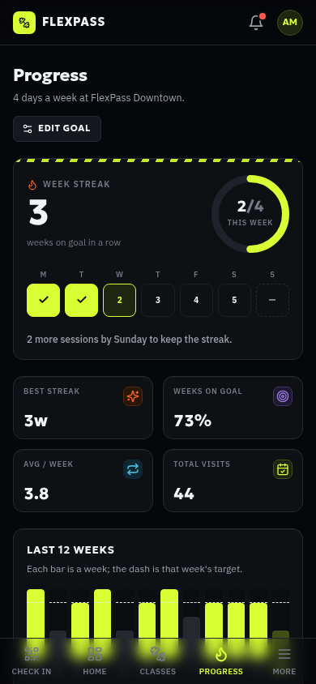
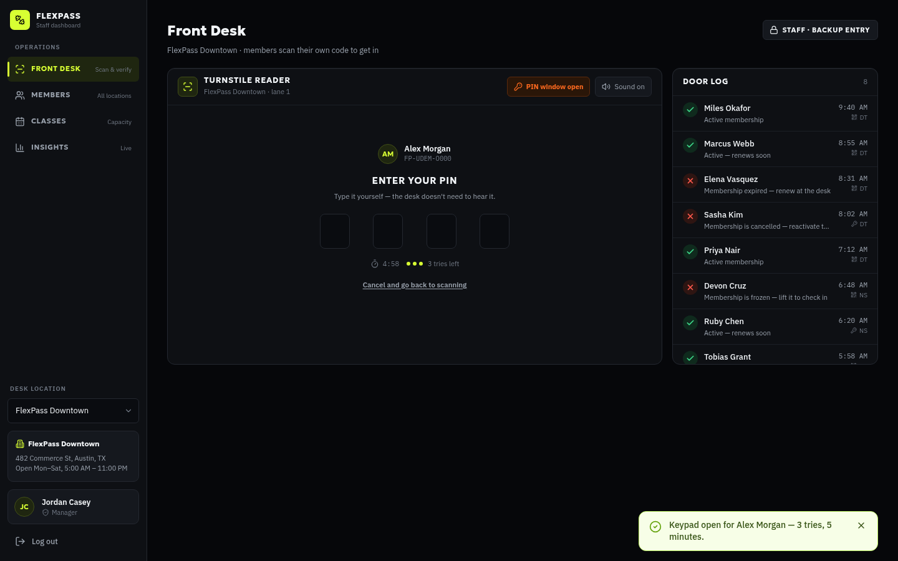

<div align="center">


# FlexPass

### A gym membership app people actually open on their phone — with a check-in QR that's actually real.

A mobile-first member portal that lands on a genuine, camera-scannable,
cryptographically signed QR code — and a completely separate staff
dashboard that scans it for real. Two real products, one database.

<p>
  
  
  
  
</p>
<p>
  
  
  
</p>

</div>

<br />

<table>
<tr>
<td width="36%" valign="top" align="center">

<sub><b>Check In is the landing page.</b><br />Open the app, see your code. That's it.</sub>
</td>
<td width="64%" valign="top" align="center">

<sub><b>A real camera reads it, a real signature verifies it.</b><br />Granted or denied, in real time, at the actual front desk.</sub>
</td>
</tr>
</table>

## Why FlexPass

- 🔐 **Real crypto, not a picture of a QR code.** Each code is an HMAC-SHA256-signed,
  60-second-rotating token, rendered as an actual scannable QR bitmap.
- 📷 **Real camera scanner, not a dropdown.** The front desk asks for the
  device camera and decodes live video with `jsQR` — a general-purpose
  reader with no idea what FlexPass is.
- 📲 **Mobile-first, for real.** Almost every member opens this on their
  phone, so the phone experience isn't an afterthought — it's page one,
  with a thumb-friendly bottom tab bar instead of a squeezed-down desktop nav.
- 🧑‍💼 **Genuinely two apps.** Separate login, separate auth, separate layout —
  a member never sees staff chrome and a staffer never sees member chrome.
- 🔑 **One way in, and a backup that can't be shared.** The reader has no
  keypad. A member without their phone asks the desk, staff find *them* by
  name, and only then does a keypad appear — accepting that one member's PIN,
  three tries, five minutes. A PIN never says who you are, so four digits
  stays safe at any member count.
- 🔥 **A streak you can actually keep.** The member sets their own target —
  "4 days a week" — and the streak counts weeks they hit it. Days the club
  was closed come out of the week first, and the live week can never be a
  miss. Entirely skippable in one switch.
- 🏋️ **Every feature a real gym app needs** — plans and upgrades, freeze/cancel,
  drop-in classes *and* ongoing groups (Pilates included), billing, progression,
  notifications, and a full staff-side member/class/insights suite.

## See it in action

**Member app — mobile-first**

<table>
<tr>
<td width="33%"></td>
<td width="33%"></td>
<td width="33%"></td>
</tr>
<tr>
<td align="center"><sub>Your goal, your streak, closed days and all</sub></td>
<td align="center"><sub>Drop-in classes & ongoing groups</sub></td>
<td align="center"><sub>Plan, billing cycle, freeze & cancel</sub></td>
</tr>
</table>

**...and it scales up cleanly**

<table>
<tr>
<td width="50%"></td>
<td width="50%"></td>
</tr>
<tr>
<td align="center"><sub>Plan status, streaks, up next</sub></td>
<td align="center"><sub>Plan comparison & upgrades</sub></td>
</tr>
</table>

**Staff dashboard**

<table>
<tr>
<td width="33%"></td>
<td width="33%"></td>
<td width="33%"></td>
</tr>
<tr>
<td align="center"><sub>Roster, search, extend & freeze</sub></td>
<td align="center"><sub>Capacity & roster manager</sub></td>
<td align="center"><sub>Live traffic & revenue insights</sub></td>
</tr>
</table>

**Two apps, two front doors**

<table>
<tr>
<td width="50%"></td>
<td width="50%"></td>
</tr>
<tr>
<td align="center"><sub>Member sign-in</sub></td>
<td align="center"><sub>Staff sign-in — different copy, different account, different app</sub></td>
</tr>
</table>

## Quick start

You need **PostgreSQL** running locally. Create the role and database once:

```bash
sudo -u postgres psql -c "CREATE ROLE flexpass LOGIN PASSWORD 'flexpass';"
sudo -u postgres psql -c "CREATE DATABASE flexpass OWNER flexpass;"
```

Then:

```bash
npm install                 # web app
npm --prefix server install # API
cp server/.env.example server/.env   # adjust DATABASE_URL if yours differs
npm run setup               # create tables + seed reference data and a demo roster
npm run dev                 # starts the API (:3000) and the web app (:5173)
```

`npm run dev` runs both processes together. The web app proxies `/api` to
the API, so everything is served from one origin — including for a phone on
your LAN, which needs no extra configuration.

Open the printed URL — it lands on the **member portal** login. Sign in with
the seeded demo member:

- **Email:** `demo@flexpass.app`
- **Password:** `flexpass123`

Sign-in is email + password. There is no SMS step and no authenticator app.

Or tap **"Create an account"** to sign up as a brand new member and pick
your own starting plan.

For the **staff dashboard**, go to `/admin` (or tap "Staff sign in →" on the
member login screen) and sign in with a seeded staff account:

- **Email:** `staff@flexpass.app` · **Password:** `flexpass123` (manager —
  full access)
- **Email:** `riley@flexpass.app` · **Password:** `flexpass123` (front desk)

Both a member session and a staff session can be signed in at the same time
in the same browser — they're stored under separate keys and don't interfere
with each other.

```bash
npm run build     # production build (tsc -b && vite build)
npm run preview   # preview the production build locally
npm run lint      # eslint
```

<details>
<summary><b>🔬 How the real, verifiable check-in codes work</b></summary>
<br />

The QR on the Check In page isn't a decorative demo stand-in — this is what
actually happens:

1. **Signing** (`src/lib/accessToken.ts`, member's browser). Every member has
   a random 256-bit `checkInSecret`, generated once at signup/seed time. The
   Check In page signs a compact token — `{uid, iat, exp}`, base64url-encoded
   — with real **HMAC-SHA256** (via the browser's SubtleCrypto), valid for a
   60-second window. It's re-signed automatically the moment the window
   rolls over, derived from wall-clock time — not a timer that resets
   whenever the page happens to mount, so it can't be kept "alive" by just
   not closing the tab.
2. **Encoding**. That token string is rendered as an actual QR bitmap by the
   `qrcode` package — real finder patterns, real error correction, a real
   image any QR reader can decode, always dark-on-light regardless of the
   app's theme (contrast is what makes a code reliably scannable, so it
   never gets themed away).
3. **Scanning** (`src/hooks/useCameraQrScanner.ts`, staff device). The
   front-desk scanner asks for the device camera, and on every frame draws
   the live video to a canvas and runs it through `jsQR` — a general-purpose
   decoder with no idea what FlexPass is. Whatever text it reads out of the
   image is exactly the token string above; nothing here is simulated.
4. **Verification** (`adminRecordScanByToken`, `src/lib/db.ts`). The decoded
   token names the member it claims to be; the scanner looks up *that
   member's* stored secret and re-derives the HMAC signature, comparing it
   with a timing-safe check. Only if it matches — right member, right
   signature, right time window — does it move on to the actual membership
   check (`evaluateAccess`). A wrong secret, a tampered signature, or a
   stale/replayed screenshot all fail right here, and it's still logged as a
   denied scan, same as a real reader rejecting a bad badge read.

**Where the key lives:** on the server, and only there. The member's app
holds no signing key and cannot mint a token for anybody — it asks
`GET /api/checkin/token` once per rotation window and renders whatever comes
back. The front desk posts the scanned string to `POST /api/admin/scan`, and
the server re-derives the signature from the key in Postgres before any
membership rule runs. That is what lets a phone the front desk has never
seen check in correctly. Everything else here (the crypto, the real
image, the real camera decode, the real signature check, the real per-member
access decision) is exactly what a production build would still be doing.

*(Camera access requires a secure context — `https://` or `localhost` — same
as any real site; this is a browser platform requirement, not something this
app can opt out of.)*

</details>

<details>
<summary><b>🔑 Why a 4-digit backup PIN is still safe at 10,000 members</b></summary>
<br />

The obvious objection to a short PIN is arithmetic: past 9,999 members two
people share one, and "who just checked in?" has no answer. The answer is
that **a PIN never identifies anybody here.**

There is no keypad on the reader. A member who turns up without their phone
asks the desk; the staffer finds *them* in the member list — by name, member
ID or email, with a photo-ID check if they want one — and opens a window
against that one user id (`adminOpenPinUnlock`). Only then does a keypad
appear on the reader, and the digits typed into it are compared against that
member's PIN and nobody else's (`adminAttemptPinUnlock`). The PIN answers
"is this you?", never "who are you?", so a collision between two members is
a non-event and the member count is irrelevant.

The rest falls out of that:

- **Three wrong tries** burns the window; it closes itself and the desk has
  to deliberately reopen it. Every wrong try is logged as a denied door scan
  against the named member, so somebody being probed is visible.
- **Five minutes** and the window times out on its own.
- **Three backup entries per 30 days** (`src/lib/pinPolicy.ts`). Past that
  the desk can still let someone in, but it takes a deliberate override
  that's stamped with the staffer's name — which is what stops "just tell
  them my PIN" from quietly becoming somebody's daily way in, and is the
  whole reason the rotating QR isn't decoration.
- **Telling a friend your PIN gets them nowhere**, because they'd first have
  to get a staffer to open a window in *your* name, standing in front of
  them.



<sub>Step one is a person, not a keypad: the staffer finds the member, sees how
much of their monthly allowance is left, and only then opens the reader.</sub>

</details>

<details>
<summary><b>🔥 Progression: a streak you can actually keep</b></summary>
<br />

"Days in a row" is a broken metric for a gym. Nobody trains seven days a
week, so it resets every week and stops meaning anything by Tuesday. So the
member sets their own target — *"I train 4 days a week"* — and the streak
counts **weeks they hit it** (`src/lib/progress.ts`).

Two rules keep it honest:

- **Days the club was shut don't count against you.** Each club carries
  `closedDays` (the demo's Downtown is closed Sundays) and `closedDates`
  (holidays, maintenance). Those come out of the week first, and the week's
  target is capped at what was actually available — aiming for 6 in a week
  with 5 open days needs 5, not 6.
- **The current week is never a miss.** It's live until Sunday, so it can
  only ever extend the streak, never break it.

On top of that: rest days the member nominates, a 12-week history where each
bar carries its own moving target line, nine badges, and consistency as a
percentage of weeks on goal. And it's **entirely skippable** — one switch in
the goal sheet turns the whole thing off and Progress becomes a plain visit
history, for the members who just want the list.

</details>

<details>
<summary><b>🧱 Tech stack & architecture</b></summary>
<br />

- **React 18 + TypeScript + Vite**, **React Router v6**, **Tailwind CSS**,
  **lucide-react** icons — no heavy UI framework, everything in
  `src/components/ui` is hand-built and shared between both apps.
  **`qrcode`** renders the real check-in QR; **`jsQR`** decodes real camera
  frames on the scanner — the only two libraries doing anything the rest of
  the app couldn't do by hand.
- **Mobile-first member nav**: on `<lg` viewports the member app uses a fixed
  bottom tab bar (`MobileTabBar`) — Check In, Home, Classes, Progress, and a
  More tab that opens the full nav drawer — instead of a desktop sidebar
  squeezed into a hamburger menu. The sidebar takes over at `lg` and up.
  Sheets and the More drawer are dragged away with a thumb
  (`useSwipeDismiss`), not just tapped shut.
- **Two apps, one router**: `App.tsx` nests two independent route subtrees —
  a member subtree (`AuthProvider` → `GymDataProvider`) and an admin subtree
  under `/admin` (`StaffAuthProvider` → `AdminDataProvider`). Each has its
  own auth context, its own data context, its own layout and guarded routes
  (`ProtectedRoute`/`GuestRoute` vs `AdminProtectedRoute`/`AdminGuestRoute`).
  They only share `ToastProvider` and the browser router itself — cross-app
  navigation is two plain links ("Staff sign in →" / "Member sign in →") on
  the two login screens.
- **API** (`server/`): Fastify + PostgreSQL. Passwords are argon2id;
  sessions are opaque random tokens in an HttpOnly cookie, stored only as a
  SHA-256 hash. `server/src/domain/` holds the rules that decide whether a
  door opens, and the check-in token signing that never leaves the process.
- **API client** (`src/lib/db.ts`): one thin module over `fetch`. Every page
  and context talks to this and nothing else, so the app has no idea where
  its data comes from.
- **Shared types** (`src/types/`) and **reference data**
  (`src/lib/reference.ts`) are imported by *both* the app and the server's
  seed script, so the two can't drift apart.
- **State**: `AuthContext` owns the member session; `DataContext` owns
  everything else for the signed-in member. `StaffAuthContext` owns the
  staff session (a separate cookie, so a member and a staffer can be signed
  in simultaneously in one browser); `AdminDataContext` owns the
  location-scoped operational data staff act on.
- **Design system**: a dark, industrial "iron & volt" theme — CSS custom
  properties in `src/index.css` (background/surface/ink tones, a volt-yellow
  primary accent, an ember secondary accent, status colors) mapped into
  `tailwind.config.js`, plus a shared `Tone` type (`src/lib/colors.ts`) so
  every badge, avatar, and chart across both apps pulls from the same
  palette.

```
src/
  components/
    ui/            shared UI kit used by both apps (Button, Card, Modal, QrCode, …)
    admin/          admin-only widgets (StatusPill, charts, Field)
    layout/         AppLayout/AuthLayout/MobileTabBar (member), AdminLayout/AdminAuthLayout (staff)
  context/          AuthContext, DataContext, StaffAuthContext, AdminDataContext, ToastContext
  hooks/            useCameraQrScanner — the real getUserMedia + jsQR capture loop
  lib/              API client (db.ts), reference data, access-control display logic, formatting, validation
  pages/            one file per member route, plus pages/admin/ for staff routes
  types/            domain types — shared with the server
server/
  src/
    routes/         auth, member, classes, checkin, admin
    domain/         access rules, PIN policy, check-in token signing (server-only)
    schema.sql      the database
    seed.ts         reference data + a demo roster
```

</details>

<details>
<summary><b>📓 Notes</b></summary>
<br />

- Data lives in PostgreSQL and is shared by every device that connects to
  the same API — sign up on a phone and the member is on the front desk's
  roster immediately. `npm run db:reset` drops every table and re-seeds.
- Password-reset codes come back in the API response rather than by email,
  because no mail transport is wired up. That is the one place this build
  knowingly stands in for infrastructure; swapping in a mailer is a change
  to one route.
- `server/.env` holds `CHECKIN_SIGNING_KEY`. Rotating it invalidates every
  outstanding check-in code at once. It is gitignored — generate a fresh one
  for anything real.
- Fonts (Geologica / IBM Plex Sans / IBM Plex Mono) load from Google Fonts
  with a system-font fallback stack, so the app still looks and reads fine
  in network-restricted environments.

</details>

<br />

<div align="center">
<sub>Multi-location gym management platform — React web apps and a Fastify + PostgreSQL API.</sub>
</div>
