<div align="center">


# FlexPass

### A gym membership app people actually open on their phone — with a check-in QR that's actually real.

A mobile-first member portal that lands on a genuine, camera-scannable,
cryptographically signed QR code — and a completely separate staff
dashboard that scans it for real. Two real products, one demo.

<p>
  
  
  
  
</p>
<p>
  
  
  
</p>

</div>

<br />

<table>
<tr>
<td width="36%" valign="top" align="center">
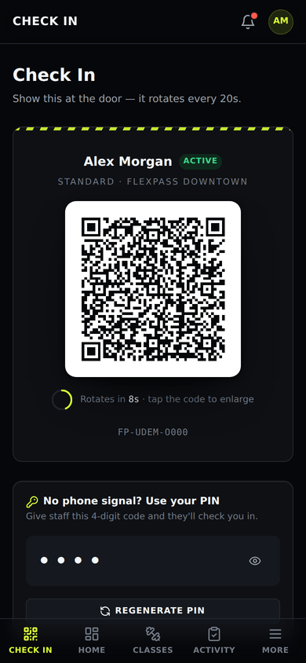
<sub><b>Check In is the landing page.</b><br />Open the app, see your code. That's it.</sub>
</td>
<td width="64%" valign="top" align="center">
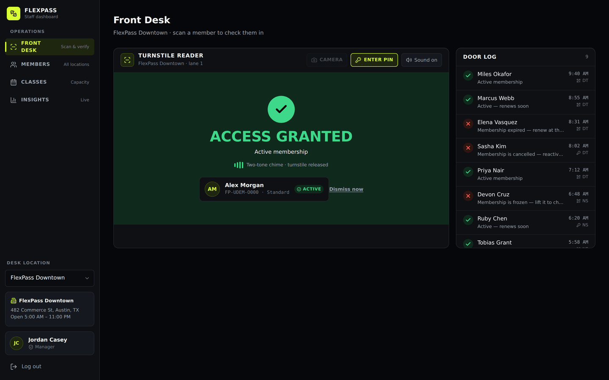
<sub><b>A real camera reads it, a real signature verifies it.</b><br />Granted or denied, in real time, at the actual front desk.</sub>
</td>
</tr>
</table>

## Why FlexPass

- 🔐 **Real crypto, not a picture of a QR code.** Each code is an HMAC-SHA256-signed,
  20-second-rotating token, rendered as an actual scannable QR bitmap.
- 📷 **Real camera scanner, not a dropdown.** The front desk asks for the
  device camera and decodes live video with `jsQR` — a general-purpose
  reader with no idea what FlexPass is.
- 📲 **Mobile-first, for real.** Almost every member opens this on their
  phone, so the phone experience isn't an afterthought — it's page one,
  with a thumb-friendly bottom tab bar instead of a squeezed-down desktop nav.
- 🧑‍💼 **Genuinely two apps.** Separate login, separate auth, separate layout —
  a member never sees staff chrome and a staffer never sees member chrome.
- 🏋️ **Every feature a real gym app needs** — plans and upgrades, freeze/cancel,
  drop-in classes *and* ongoing groups (Pilates included), billing, streaks,
  notifications, and a full staff-side member/class/insights suite.

## See it in action

**Member app — mobile-first**

<table>
<tr>
<td width="50%">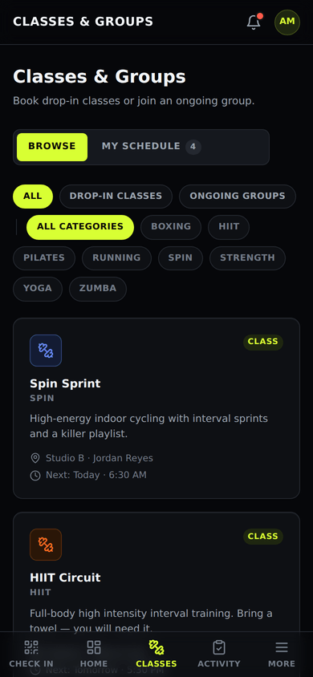</td>
<td width="50%">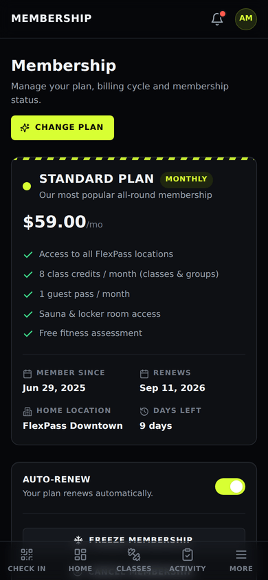</td>
</tr>
<tr>
<td align="center"><sub>Drop-in classes & ongoing groups</sub></td>
<td align="center"><sub>Plan, billing cycle, freeze & cancel</sub></td>
</tr>
</table>

**...and it scales up cleanly**

<table>
<tr>
<td width="50%">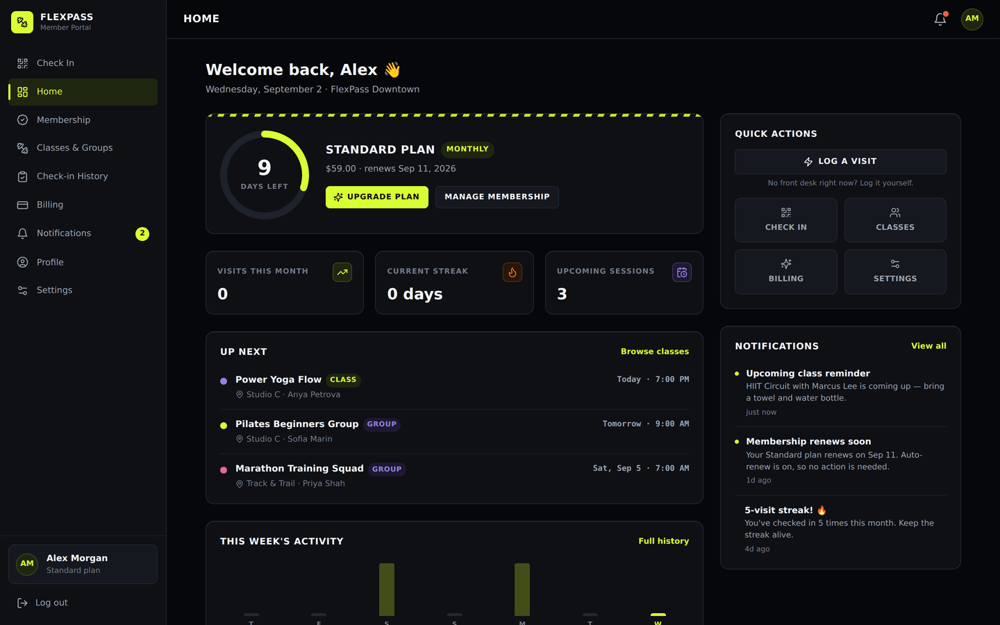</td>
<td width="50%">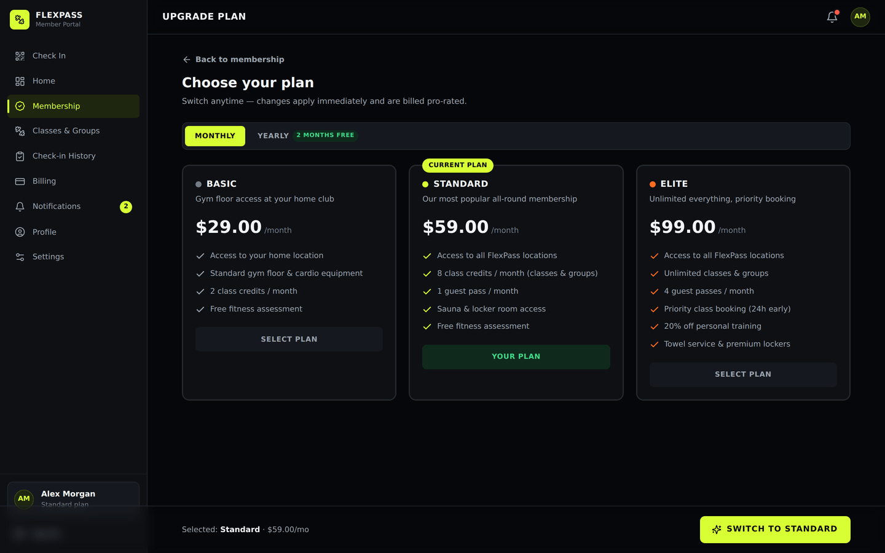</td>
</tr>
<tr>
<td align="center"><sub>Plan status, streaks, up next</sub></td>
<td align="center"><sub>Plan comparison & upgrades</sub></td>
</tr>
</table>

**Staff dashboard**

<table>
<tr>
<td width="33%">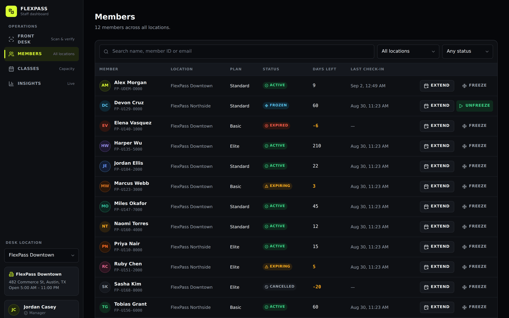</td>
<td width="33%">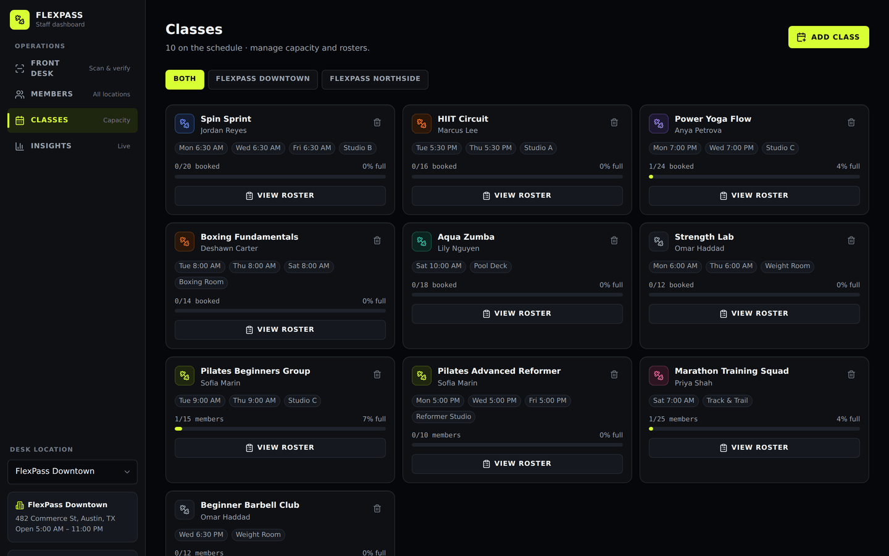</td>
<td width="33%">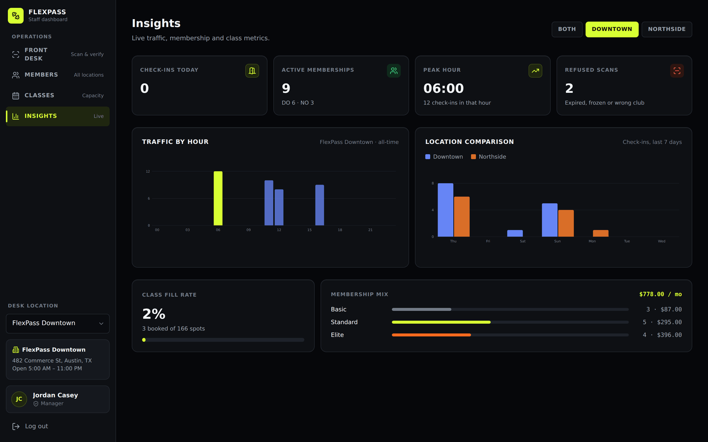</td>
</tr>
<tr>
<td align="center"><sub>Roster, search, extend & freeze</sub></td>
<td align="center"><sub>Capacity & roster manager</sub></td>
<td align="center"><sub>Live traffic & revenue insights</sub></td>
</tr>
</table>

**Two apps, two front doors**

<table>
<tr>
<td width="50%">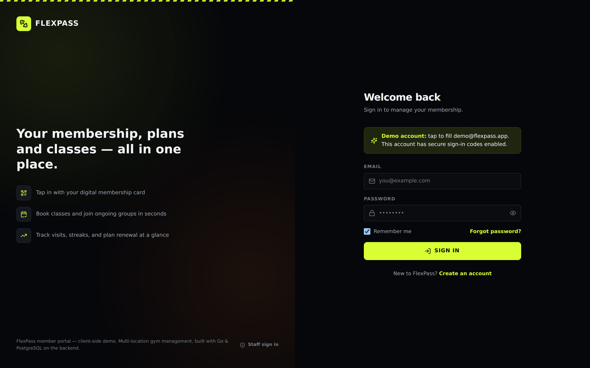</td>
<td width="50%">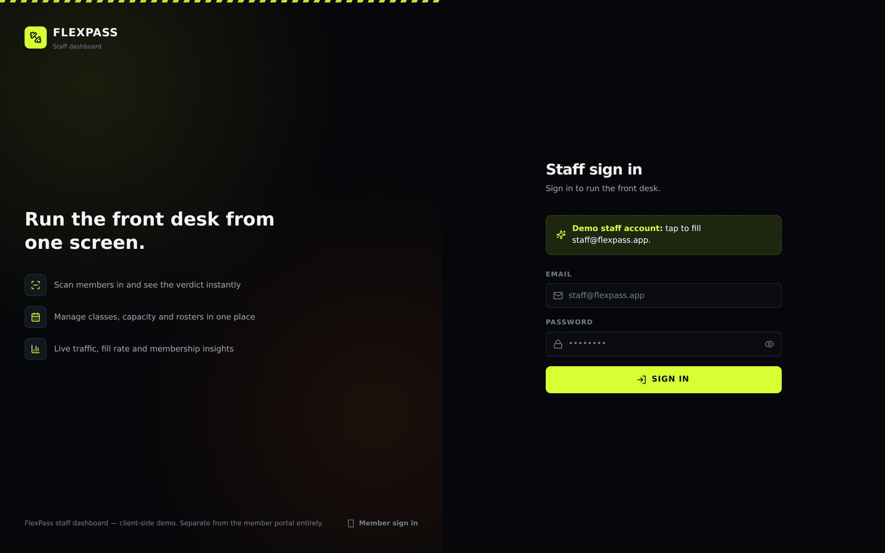</td>
</tr>
<tr>
<td align="center"><sub>Member sign-in</sub></td>
<td align="center"><sub>Staff sign-in — different copy, different account, different app</sub></td>
</tr>
</table>

## Quick start

```bash
npm install
npm run dev
```

Open the printed local URL — it lands on the **member portal** login. Sign
in with the seeded demo member:

- **Email:** `demo@flexpass.app`
- **Password:** `flexpass123`
- This account has two-factor sign-in enabled — the verification code screen
  shows the demo code directly in a banner (no real SMS/email is sent).

Or tap **"Create an account"** to sign up as a brand new member and pick
your own starting plan.

For the **staff dashboard**, go to `/admin` (or tap "Staff sign in →" on the
member login screen) and sign in with a seeded staff account:

- **Email:** `staff@flexpass.app` · **Password:** `flexpass123` (manager —
  full access)
- **Email:** `riley@flexpass.app` · **Password:** `flexpass123` (front desk)

Both a member session and a staff session can be signed in at the same time
in the same browser — they're stored under separate keys and don't interfere
with each other.

```bash
npm run build     # production build (tsc -b && vite build)
npm run preview   # preview the production build locally
npm run lint      # eslint
```

<details>
<summary><b>🔬 How the real, verifiable check-in codes work</b></summary>
<br />

The QR on the Check In page and the PIN beneath it aren't decorative demo
stand-ins — this is what actually happens:

1. **Signing** (`src/lib/accessToken.ts`, member's browser). Every member has
   a random 256-bit `checkInSecret`, generated once at signup/seed time. The
   Check In page signs a compact token — `{uid, iat, exp}`, base64url-encoded
   — with real **HMAC-SHA256** (via the browser's SubtleCrypto), valid for a
   20-second window. It's re-signed automatically the moment the window
   rolls over, derived from wall-clock time — not a timer that resets
   whenever the page happens to mount, so it can't be kept "alive" by just
   not closing the tab.
2. **Encoding**. That token string is rendered as an actual QR bitmap by the
   `qrcode` package — real finder patterns, real error correction, a real
   image any QR reader can decode, always dark-on-light regardless of the
   app's theme (contrast is what makes a code reliably scannable, so it
   never gets themed away).
3. **Scanning** (`src/hooks/useCameraQrScanner.ts`, staff device). The
   front-desk scanner asks for the device camera, and on every frame draws
   the live video to a canvas and runs it through `jsQR` — a general-purpose
   decoder with no idea what FlexPass is. Whatever text it reads out of the
   image is exactly the token string above; nothing here is simulated.
4. **Verification** (`adminRecordScanByToken`, `src/lib/db.ts`). The decoded
   token names the member it claims to be; the scanner looks up *that
   member's* stored secret and re-derives the HMAC signature, comparing it
   with a timing-safe check. Only if it matches — right member, right
   signature, right time window — does it move on to the actual membership
   check (`evaluateAccess`). A wrong secret, a tampered signature, or a
   stale/replayed screenshot all fail right here, and it's still logged as a
   denied scan, same as a real reader rejecting a bad badge read.

**The one honest limit:** there's no backend yet, so the signing key a
member's code is signed with lives in the same client-side store their own
app reads it from, rather than only ever living on a server the client never
sees. In production that's the one thing that moves — server holds the
secret and signs on request, client displays what it's given, scanner
verifies against the server — without changing this token format, the QR
rendering, or the scanner at all. Everything else here (the crypto, the real
image, the real camera decode, the real signature check, the real per-member
access decision) is exactly what a production build would still be doing.

*(Camera access requires a secure context — `https://` or `localhost` — same
as any real site; this is a browser platform requirement, not something this
app can opt out of.)*

</details>

<details>
<summary><b>🧱 Tech stack & architecture</b></summary>
<br />

- **React 18 + TypeScript + Vite**, **React Router v6**, **Tailwind CSS**,
  **lucide-react** icons — no heavy UI framework, everything in
  `src/components/ui` is hand-built and shared between both apps.
  **`qrcode`** renders the real check-in QR; **`jsQR`** decodes real camera
  frames on the scanner — the only two libraries doing anything the rest of
  the app couldn't do by hand.
- **Mobile-first member nav**: on `<lg` viewports the member app uses a fixed
  bottom tab bar (`MobileTabBar`) — Check In, Home, Classes, Activity, and a
  More tab that opens the full nav drawer — instead of a desktop sidebar
  squeezed into a hamburger menu. The sidebar takes over at `lg` and up.
- **Two apps, one router**: `App.tsx` nests two independent route subtrees —
  a member subtree (`AuthProvider` → `GymDataProvider`) and an admin subtree
  under `/admin` (`StaffAuthProvider` → `AdminDataProvider`). Each has its
  own auth context, its own data context, its own layout and guarded routes
  (`ProtectedRoute`/`GuestRoute` vs `AdminProtectedRoute`/`AdminGuestRoute`).
  They only share `ToastProvider` and the browser router itself — cross-app
  navigation is two plain links ("Staff sign in →" / "Member sign in →") on
  the two login screens.
- **Mock backend** (`src/lib/db.ts` + `src/lib/seedData.ts`): simulates a
  real API — async functions with network-like latency, seeded realistic
  data (multiple locations, a 12-member roster covering every membership
  status, staff accounts, door-scan history), persisted to `localStorage`.
  Swapping this for real `fetch` calls against the Go backend later
  shouldn't require touching any page — the four contexts are the only
  things that talk to it.
- **State**: `AuthContext` owns the member session; `DataContext` owns
  everything else for the signed-in member. `StaffAuthContext` owns the
  staff session (a separate `localStorage` key, so a member and a staffer
  can be signed in simultaneously in one browser); `AdminDataContext` owns
  the location-scoped operational data staff act on.
- **Design system**: a dark, industrial "iron & volt" theme — CSS custom
  properties in `src/index.css` (background/surface/ink tones, a volt-yellow
  primary accent, an ember secondary accent, status colors) mapped into
  `tailwind.config.js`, plus a shared `Tone` type (`src/lib/colors.ts`) so
  every badge, avatar, and chart across both apps pulls from the same
  palette.

```
src/
  components/
    ui/            shared UI kit used by both apps (Button, Card, Modal, QrCode, …)
    admin/          admin-only widgets (StatusPill, charts, Field)
    layout/         AppLayout/AuthLayout/MobileTabBar (member), AdminLayout/AdminAuthLayout (staff)
  context/          AuthContext, DataContext, StaffAuthContext, AdminDataContext, ToastContext
  hooks/            useCameraQrScanner — the real getUserMedia + jsQR capture loop
  lib/              mock backend, access-control logic, accessToken (sign/verify), formatting, validation
  pages/            one file per member route, plus pages/admin/ for staff routes
  types/            shared domain types
```

</details>

<details>
<summary><b>📓 Notes</b></summary>
<br />

- This is a **client-side demo**: all "network" calls are mocked with
  artificial latency, and data lives in your browser's `localStorage`. Use
  **Settings → Danger zone → Reset demo data** (member side) to start over;
  clearing site data resets the staff side too, since it's the same origin.
- Two-factor and password-reset codes are shown directly on screen (labeled
  "Demo mode") since there's no real email/SMS backend yet — the UX flow is
  otherwise exactly what a production version would look like.
- Fonts (Geologica / IBM Plex Sans / IBM Plex Mono) load from Google Fonts
  with a system-font fallback stack, so the app still looks and reads fine
  in network-restricted environments.

</details>

<br />

<div align="center">
<sub>Multi-location gym management platform. This repository is the client-side front end; the production API is Go + PostgreSQL.</sub>
</div>
